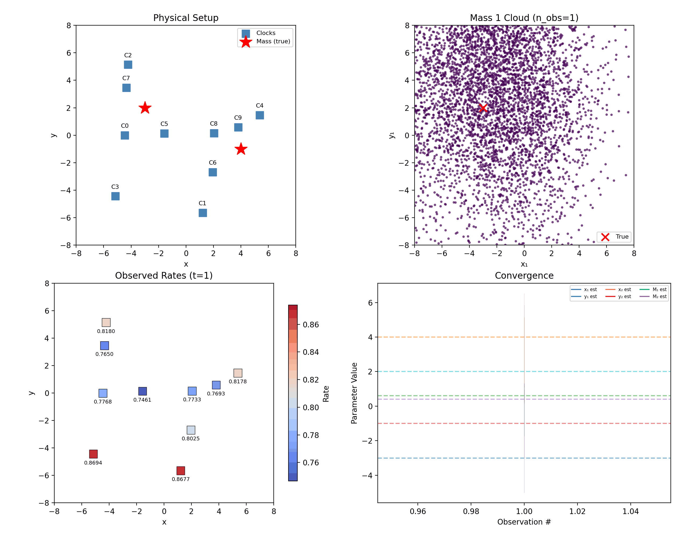
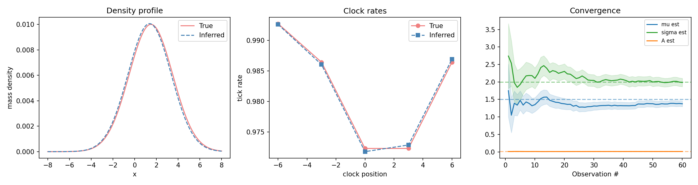

# clocks

Gravitational time dilation simulation and inference library.

**Website:** [jbwhit.github.io/clocks](https://jbwhit.github.io/clocks/) — the full story, from GPS corrections through model comparison, continuous densities, and 3D gravitational echolocation.

Place atomic clocks near a hidden mass — they tick slower in the gravitational well. A particle filter (Sequential Monte Carlo) watches the noisy tick rates and infers the mass's position and magnitude — GPS run in reverse.

## How it works

**Forward model:** Given one or more point masses at positions **x**_j with masses M_j, compute the Newtonian gravitational potential at each clock, then derive the weak-field GR time dilation factor (tick rate). Uses simulation units where G = c = 1.

**Inverse problem:** A particle filter maintains a cloud of hypotheses for the unknown parameters. Each observation (noisy clock rates) reweights particles by likelihood, and resampling with jitter reduces particle degeneracy. In well-conditioned scenarios, the cloud concentrates near the true parameters.

The point-mass forward model and core particle filter are dimension-agnostic, with examples in 1D, 2D, and 3D.

## Setup

Requires Python 3.12+ and [uv](https://docs.astral.sh/uv/).

```bash
uv sync
```

## Use as a library

The package exposes stable end-to-end entry points for simulation and inference:

```python
import numpy as np

from clocks import (
    ClockArray,
    InferenceConfig,
    MassConfig,
    NoiseConfig,
    PriorConfig,
    SimulationConfig,
    infer,
    simulate,
)

clock_array = ClockArray(
    positions=np.array([[-6.0], [-3.0], [0.0], [3.0], [6.0]]),
    track_offset=1.0,
)
ground_truth = MassConfig(
    positions=np.array([[-2.0], [3.0]]),
    masses=np.array([0.6, 0.4]),
)

simulation = simulate(
    SimulationConfig(
        clock_array=clock_array,
        ground_truth=ground_truth,
        noise=NoiseConfig(observation_std=0.005),
        n_observations=40,
        seed=42,
    )
)

result = infer(
    simulation.observations,
    InferenceConfig(
        clock_array=clock_array,
        noise=NoiseConfig(observation_std=0.005),
        prior=PriorConfig(position_range=(-8.0, 8.0), mass_range=(0.1, 2.0)),
        n_particles=1500,
        n_masses=(1, 2, 3),
        seed=42,
    ),
)

print(result.best_model)
print(result.posterior_by_model)
```

For fixed-K inference, pass an integer to `n_masses` instead of a tuple. Model-comparison results (`n_masses` as a tuple) expose `best_model` and `posterior_by_model`; fixed-K results (`n_masses` as an int) expose a posterior summary instead (`posterior_mean`, `posterior_std`, `history`).

To drive the filter observation-by-observation (e.g. for custom animation),
build the same filter `infer` uses internally:

```python
from clocks import build_particle_filter

fixed_k_config = InferenceConfig(
    clock_array=clock_array,
    noise=NoiseConfig(observation_std=0.005),
    prior=PriorConfig(position_range=(-8.0, 8.0), mass_range=(0.1, 2.0)),
    n_particles=1500,
    n_masses=2,
    seed=42,
)
pf = build_particle_filter(fixed_k_config)
for obs in simulation.observations:
    pf.update(obs)
print(pf.estimate())
```

## Run the demos

**1D** — 3 clocks on a line, infer (x, M):

```bash
uv run demo-1d    # → output/demo_1d.gif
```


**2D** — 8 clocks on a plane, infer (x, y, M):

```bash
uv run demo-2d    # → output/demo_2d.gif
```


Each produces an animated GIF showing a 2×2 dashboard: physical setup, particle cloud converging on the true parameters, observed clock rates, and convergence history with uncertainty bands.

**Multi-mass (1D)** — 5 clocks, infer 2 masses simultaneously (x₁, x₂, M₁, M₂):

```bash
uv run demo-multi-mass    # → output/demo_multi_mass.gif
```


**Multi-mass (2D)** — 10 random clocks on a plane, infer 2 masses (x₁, y₁, x₂, y₂, M₁, M₂):

```bash
uv run demo-multi-mass-2d    # → output/demo_multi_mass_2d.gif
```



**Model comparison** — 5 clocks, 2 hidden masses, infer K:

```bash
uv run demo-model-comparison    # → output/demo_model_comparison.gif
```


Runs parallel particle filters for K=1..3 masses and tracks posterior probabilities. The correct model (K=2) is identified within a few observations.

**Gaussian density** — 5 clocks, infer a continuous mass distribution (μ, σ, amplitude):

```bash
uv run demo-density    # → output/demo_density.png
```



**3D echolocation** — a 3×3×3 "head" of 27 clocks senses a single
*exterior* mass from differential (mean-centered) rates only — the head
has no outside time reference. Demo seed/range are curated for clarity;
`scripts/scan_echolocation_range.py` runs the uncurated resolution-vs-range
study behind the site page:

```bash
uv run demo-echolocation-3d    # → output/demo_echolocation_3d.gif
```


## Run tests

`uv run pytest` runs the default non-slow suite; run `uv run pytest -m slow` for the long acceptance scans.

```bash
uv run pytest
uv run ruff check src/ tests/ scripts/   # lint
```

## Project structure

```
src/clocks/
    types.py       Data structures (MassConfig, ClockArray, Observation, ParticleState)
    config.py      Public config dataclasses (SimulationConfig, InferenceConfig, ...)
    results.py     Public result dataclasses (SimulationResult, InferenceResult, ...)
    api.py         End-to-end entry points (simulate, infer, build_particle_filter)
    physics.py     Forward model: mass config → clock tick rates
    noise.py       Gaussian noise model and log-likelihood
    inference.py   Particle filter (SMC with systematic/stratified/residual resampling)
    viz.py         Plotting and animation facade (_panels.py, _panels3d.py, _animate.py)
    _panels3d.py   3D plotting primitives for the echolocation dashboard
    _scenarios.py  Shared scenario builders for demos/scan harnesses/tests
    _echo_study.py Reporting helpers for the echolocation range study
    _cli.py        Entry points for demo scripts
scripts/
    demo_1d.py                    1D end-to-end demo
    demo_2d.py                    2D end-to-end demo
    demo_multi_mass.py            Two masses in 1D
    demo_multi_mass_2d.py         Two masses in 2D (random clocks)
    demo_model_comparison.py      Bayesian model comparison (infer K)
    demo_density.py               Gaussian density forward model
    demo_echolocation_3d.py       27-clock 3D echolocation demo (rotating camera)
    scan_echolocation_range.py    Resolution-vs-range study for 3D echolocation
    scan_multi_mass_2d.py         Seed-scan harness for the multi-mass-2D scenario
tests/
    Unit, scenario, visualization, echo-study, and slow acceptance tests —
    see `tests/` for the current inventory.
```
