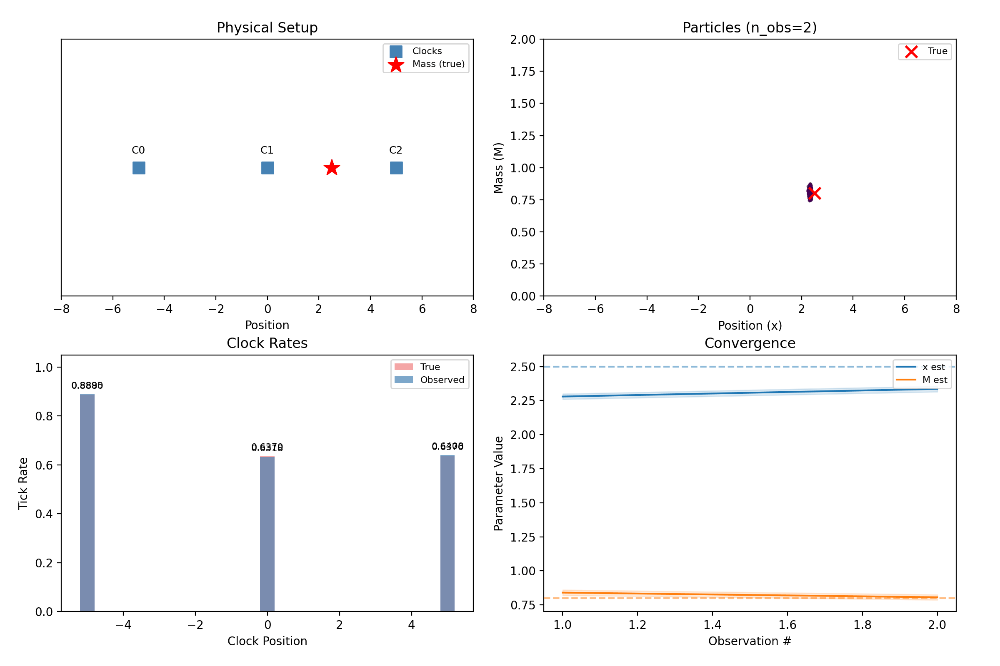
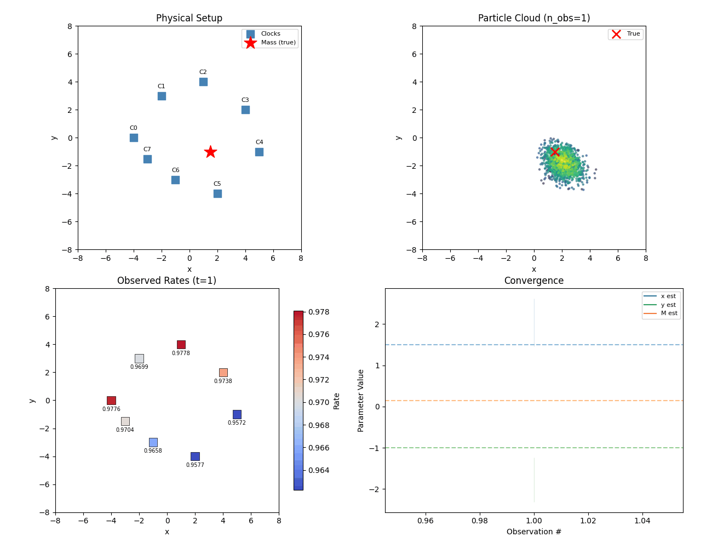
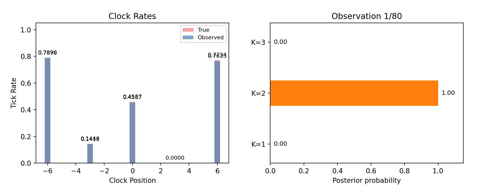

# clocks

Gravitational time dilation simulation and inference library.

Place atomic clocks near a hidden mass — they tick slower in the gravitational well. A particle filter (Sequential Monte Carlo) watches the noisy tick rates and infers the mass's position and magnitude, acting like a relativistic GPS.

## How it works

**Forward model:** Given a point mass at position **x** with mass M, compute the Newtonian gravitational potential at each clock, then derive the GR time dilation factor (tick rate). Uses simulation units where G = c = 1.

**Inverse problem:** A particle filter maintains a cloud of hypotheses for the unknown parameters. Each observation (noisy clock rates) reweights particles by likelihood, and systematic resampling with jitter prevents degeneracy. The cloud converges on the true parameters.

The physics and inference are dimension-agnostic — the same code handles 1D, 2D, and 3D.

## Setup

Requires Python 3.12+ and [uv](https://docs.astral.sh/uv/).

```bash
uv sync
```

## Run the demos

**1D** — 3 clocks on a line, infer (x, M):

```bash
uv run demo-1d    # → output/demo_1d.gif
```



**2D** — 8 clocks on a plane, infer (x, y, M):

```bash
uv run demo-2d    # → output/demo_2d.gif
```



Each produces an animated GIF showing a 2×2 dashboard: physical setup, particle cloud converging on the true parameters, observed clock rates, and convergence history with uncertainty bands.

**Model comparison** — 5 clocks, 2 hidden masses, infer K:

```bash
uv run demo-model-comparison    # → output/demo_model_comparison.gif
```



Runs parallel particle filters for K=1..3 masses and tracks posterior probabilities. The correct model (K=2) is identified within a few observations.

## Run tests

```bash
uv run pytest                # 42 tests
uv run ruff check src/ tests/ scripts/   # lint
```

## Project structure

```
src/clocks/
    types.py       Data structures (MassConfig, ClockArray, Observation, ParticleState)
    physics.py     Forward model: mass config → clock tick rates
    noise.py       Gaussian noise model and log-likelihood
    inference.py   Particle filter (SMC with systematic resampling)
    viz.py         Matplotlib plotting and animation (1D + 2D)
scripts/
    demo_1d.py               1D end-to-end demo
    demo_2d.py               2D end-to-end demo
    demo_multi_mass.py       Two masses in 1D
    demo_model_comparison.py Bayesian model comparison (infer K)
    demo_density.py          Gaussian density forward model
tests/
    test_physics.py, test_inference.py, test_noise.py, test_viz.py
```
