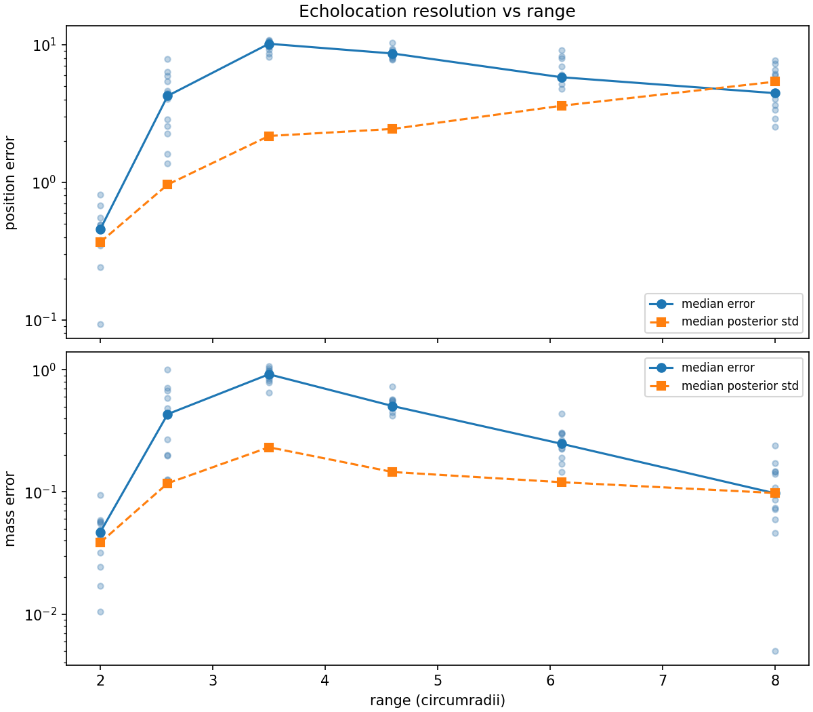

## A sense you weren't born with

Imagine someone — call her the synesthete — born with a lattice of atomic
clocks embedded in her head — twenty-seven of them, arranged in a neat
3×3×3 grid. Every mass in
the world dents spacetime, and clocks deeper in the dent tick slower. Could
such a person *feel* the masses around them, the way echolocation feels
surfaces?

One constraint makes this premise honest: the head carries no outside
reference. There is no distant master clock to compare against — only the
twenty-seven clocks against each other. Whatever is sensed must live in
the *differences* between their tick rates, never in their absolute values.

That is a well-posed physics question, and everything on this site so far
— the forward model, the particle filter, the degeneracy analysis — is
already dimension-agnostic. So: how far can this sense reach?

## What an exterior mass shows the head

Every previous page hid the mass *inside* the sensor array. An exterior
mass is a harder target: it shifts all twenty-seven clocks by nearly the
same amount (a common-mode offset, ∝ M/R), and that shared offset is
exactly what the head cannot perceive. Subtract the mean and what remains
is the *gradient* of the potential across the head — falling off as 1/R²
— plus the still-fainter curvature that distinguishes "small mass nearby"
from "large mass far away." Direction is cheap; range is expensive. This
is the [mass–distance degeneracy](one-clock-is-not-enough.qmd) in its
purest form.

```{python}
#| code-fold: true
#| fig-cap: "The differential signal an exterior mass leaves on the head, vs range. The dashed line is the per-observation noise floor; the sense must work in the shrinking gap above it."
import matplotlib.pyplot as plt
import numpy as np
from clocks import clock_rates
from clocks._scenarios import (
    ECHO_NOISE_STD,
    build_head_lattice,
    contrast_matrix,
    echo_mass_config,
)

head = build_head_lattice()
ranges = np.linspace(2.0, 10.0, 60)  # from the validated exterior minimum
signal = []
q = contrast_matrix(len(head.positions))
for r in ranges:
    rates = clock_rates(echo_mass_config(float(r)), head)
    signal.append(np.max(np.abs(q @ rates)))

fig, ax = plt.subplots()
ax.semilogy(ranges, signal, color="steelblue", label="differential signal")
ax.axhline(
    ECHO_NOISE_STD, color="lightcoral", linestyle="--", label="noise floor"
)
ax.set_xlabel("range (circumradii)")
ax.set_ylabel("max orthonormal contrast")
ax.legend()
plt.close(fig)
fig
```

The display subtracts the channel mean, but the likelihood uses an exact
orthonormal contrast transform. For $C$ labeled clocks, let $Q$ have
$C-1$ orthonormal rows perpendicular to the all-ones vector. Then
$Q\mathbf{1}=0$ and $QQ^T=I_{C-1}$. If the raw channel noise is
$\epsilon\sim\mathcal N(0,\sigma^2 I_C)$, the contrast noise is therefore

$$Q\epsilon\sim\mathcal N(0,\sigma^2 I_{C-1}).$$

The $C-1$ coordinates preserve the iid variance and the likelihood's
normalization after the unobservable common mode is discarded. Centered
$C$-vectors remain useful for plotting, but treating their correlated
components as independent would give the wrong absolute
[evidence normalization](../method/the-particle-filter.qmd#sec-evidence).

## Watching the head lock on

The legacy demo places the mass at two circumradii along a fixed off-axis
direction and shows eighty differential observations while the camera orbits.
It is one fixed-seed visualization at the closest, most favorable range, not a
reliability measurement.


This committed GIF is a pre-remediation illustration pending Task 11
calibration and regeneration, not a result from the corrected contrast-space
SMC implementation.

## How far does the sense reach?

The range harness sweeps the declared circumradius grid and records position
error, mass error, posterior standard deviations, coverage, residuals, SMC
controls, and forward-model evaluation counts. Development seeds will select
controls by a declared ranking; only after those controls and tolerances are
frozen may the untouched 400–411 block be run once. Neither step has happened
yet for the corrected implementation.



The displayed study is the legacy pre-remediation artifact. Task 11 will
replace it after development calibration and the one-shot protected run; its
current points must not be read as corrected-SMC evidence.

When completed, that protocol will guard against tuning directly to the
reported holdout, but its fixed seeds will still provide regression and
calibration evidence only for those simulated cases. It will not estimate a
population reliability or justify a universal pass probability. The
physically robust trend is the signal scaling: the differential gradient
falls as $1/R^2$, while the curvature that helps separate mass from range
falls as $1/R^3$.

## Verdict

The surrogate poses a coherent inverse problem inside its $|2\Phi|\le0.1$
domain, but exterior range is intrinsically difficult. Direction is carried
by the leading gradient; separating a nearby small mass from a farther heavy
one leans on the weaker curvature. Any claimed sensing horizon must therefore
be attached to a stated noise model, prior, particle budget, SMC controls,
pass rule, and finite seed set—not promoted to a property of the population.

## Coda: could she feel the Sun?

The simulation runs in units where G = c = 1, but nothing stops us from
asking the question in SI. Give the head a 10 cm clock baseline. For this
estimate, assume a clock budget with fractional-frequency instability near
$10^{-16}/\sqrt{\tau}$ and a systematic floor around $10^{-18}$ — and ask:
sitting long and still enough, could she feel the Sun? Jupiter?

```{python}
#| code-fold: true
import math

from IPython.display import Markdown

C2 = 8.987551787e16  # c^2, (m/s)^2
BASELINE = 0.1  # clock baseline inside the head, m
SIGMA0 = 1e-16  # clock instability: sigma_y(tau) = SIGMA0 / sqrt(tau)
FLOOR = 1e-18  # systematic floor
GM_SUN, GM_JUP = 1.327124e20, 1.266865e17  # m^3/s^2
AU, R_EARTH, G_SURFACE = 1.495979e11, 6.371e6, 9.80665


def gradient(gm, r):
    """Differential rate across the baseline, held static at range r."""
    return gm * BASELINE / (r**2 * C2)


def tide(gm, r):
    """Surviving differential for a head riding the freely falling Earth.

    Best case: a vertical baseline at the sub-source point, where the
    tidal factor (3 cos^2 theta - 1) reaches its maximum of 2.
    """
    return 2 * gm * R_EARTH * BASELINE / (r**3 * C2)


def sitting_time(signal):
    tau = (SIGMA0 / signal) ** 2
    for label, unit in [("seconds", 1.0), ("hours", 3600.0), ("days", 86400.0)]:
        if tau < 1000 * unit:
            return f"{tau / unit:.0f} {label}"
    years = tau / 3.156e7
    if years < 1e4:
        return f"{years:.0f} years"
    return f"$10^{{{round(math.log10(years))}}}$ years"


def vs_floor(signal):
    ratio = signal / FLOOR
    if ratio >= 1:
        return f"{ratio:.0f}× above"
    ratio = 1.0 / ratio
    if ratio < 1000:
        return f"{ratio:.0f}× below"
    return f"$10^{{{round(math.log10(ratio))}}}$× below"


ROWS = [
    ("Earth, from a chair", G_SURFACE * BASELINE / C2),
    ("Sun, hovering static at 1 AU", gradient(GM_SUN, AU)),
    ("Sun, from a chair on Earth", tide(GM_SUN, AU)),
    ("Jupiter, from a chair on Earth", tide(GM_JUP, 4.2 * AU)),
    ("Jupiter, hovering 100,000 km from center", gradient(GM_JUP, 1.0e8)),
]
lines = [
    "| Source | Differential signal | Sitting time (statistical)"
    " | vs systematic floor |",
    "|---|---|---|---|",
]
for name, s in ROWS:
    lines.append(f"| {name} | {s:.1e} | {sitting_time(s)} | {vs_floor(s)} |")
Markdown("\n".join(lines))
```

Earth passes immediately. The vertical gradient across her own head is
$1.1\times10^{-17}$. Laboratory clocks have resolved the same
gravitational-redshift effect across a single millimeter, about
$1.1\times10^{-19}$ — so a minute or two of stillness gives her *down*,
permanently and unambiguously.

The Sun is stranger. Hovering motionless at 1 AU the signal exists, and
seven patient years would statistically resolve it — but it sits two
orders of magnitude beneath today's systematic floor, so that sense waits
on the next generation of clocks. And from a chair on Earth the problem
changes in kind, not just degree: the Earth free-falls around the Sun,
and free fall cancels that leading $1/R^2$ gradient exactly — the
equivalence principle, enforcing itself. What survives inside the head is
the tidal residue: real physics, measurable in principle, but four
further orders down even with the most favorable alignment, and a million
times beneath the floor. No amount of focus recovers the term geometry
has removed — no future clock, however good, can measure a signal the
equivalence principle has already cancelled. (Earthbound clock networks
genuinely do see lunar and solar
signatures near the $10^{-17}$ level — tidal-potential and solid-Earth
responses spread across continental baselines. Across a single head,
though, that ride is common mode: centering erases it, leaving only the
local residue already in the table.)

Jupiter, from Earth, is beyond hopeless. To feel Jupiter she must go
there — and *hold station*, engines burning. Because an orbit is free
fall: it removes the leading $1/R^2$ gradient and leaves only the much
smaller tidal residue. Hovering 100,000 km from
Jupiter's center — barely 30,000 km above the cloud tops — Jupiter
presses on her clocks as strongly as Earth does from a chair: one
meditative minute.

There is a familiar shape in all this. Setting the signal against the
$10^{-18}$ floor gives the head a detection horizon of about 0.08 AU for
a Sun-sized mass — and the Sun sits twelve times beyond its own horizon,
an illustration of how quickly a differential signal loses to an instrument
floor. And even inside the horizon, the caveat becomes absolute at astronomical
range: the curvature term that separates mass from distance is suppressed
by a further factor of baseline over range, about $10^{-12}$ at 1 AU. She
could feel direction and pull, never distance — a presence, not a place.
Which may be the most meditative conclusion physics has on offer.

::: {.callout-note title="Reproduce"}
`uv run demo-echolocation-3d` regenerates the demo;
`uv run scripts/scan_echolocation_range.py --seed-block 0 --workers 8 --per-run`
runs the development grid. A future reserved run will use the scenario-default
cell via `--seed-block 400`; protected blocks reject control
overrides, but those defaults are not scientifically frozen until Task 11.
The protected command has not been run.
See
[Getting Started](../reproduce/getting-started.qmd).
:::
