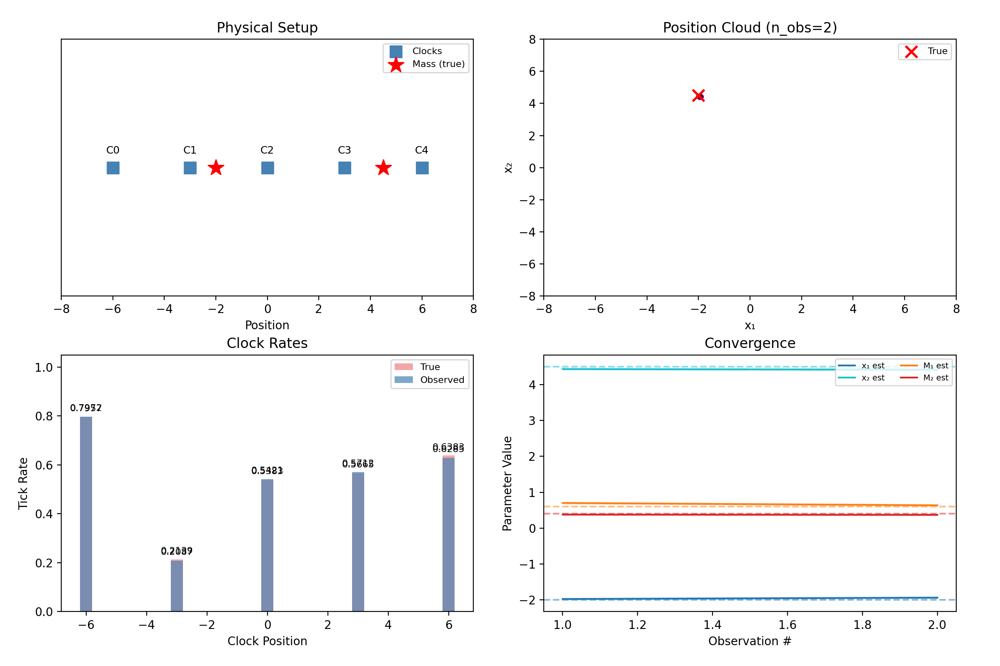

## The problem doubles

Two masses in 1D means four unknowns ($x_1, x_2, M_1, M_2$); on a plane,
six. The potential is just the sum of the two wells, but the inverse
problem gets qualitatively harder, not merely bigger.




Both committed GIFs are pre-remediation illustrations pending certification
and regeneration; they are not current SMC result evidence.

## Label switching — an honest limitation

"Mass 1" and "mass 2" are *our* labels; the physics doesn't care. A
hypothesis with the masses swapped predicts identical clock rates, so the
true [posterior](../method/notation-and-glossary.qmd#term-posterior) is perfectly bimodal — and the mean of a bimodal cloud lands
meaninglessly between the modes. The library instead represents the
normalized ordered version of the exchangeable prior: initial position-mass
pairs are sorted together by the first spatial coordinate (so $x_1 < x_2$ in
this notation). During
[rejuvenation](../method/the-particle-filter.qmd#sec-resampling), a proposal
that crosses that strict boundary is rejected. Sorting proposals after they
are drawn would obscure the proposal density and is not used.

What this does **not** solve: when the two masses nearly share an
x-coordinate, the sort boundary slices right through the posterior, and
sampling can become difficult. The 1D demo's
second mass originally sat at $x_2 = 3.0$, exactly on top of a clock and
close enough to cause trouble, and was moved to $4.5$ to keep the demo
crisp. Ordering is an identifiable parameterization, not evidence that the
physical masses have intrinsic labels.

## Superposition is the enemy

Why is this hard at all? Because summed potentials hide their parts — and
the clocks only see the tick rates the summed potential produces:

```{python}
#| code-fold: true
#| fig-cap: "Tick-rate profiles for the two demo masses against a single mass of the combined weight placed between them. At the five clock positions (dots), the curves nearly agree — the filter must live off the small residuals."
import matplotlib.pyplot as plt
import numpy as np
from clocks import ClockArray, MassConfig, clock_rates

clock_positions = np.array([[-6.0], [-3.0], [0.0], [3.0], [6.0]])
clock_array = ClockArray(positions=clock_positions, track_offset=2.0)
two_masses = MassConfig(
    positions=np.array([[-2.0], [4.5]]), masses=np.array([0.045, 0.030])
)
one_mass = MassConfig(positions=np.array([[0.6]]), masses=np.array([0.075]))

xs = np.linspace(-8, 8, 300).reshape(-1, 1)
dense = ClockArray(positions=xs, track_offset=2.0)
fig, ax = plt.subplots()
for config, label, color in [
    (two_masses, "two masses (truth)", "lightcoral"),
    (one_mass, "one combined mass", "steelblue"),
]:
    ax.plot(xs[:, 0], clock_rates(config, dense), color=color, label=label)
    ax.plot(
        clock_positions[:, 0], clock_rates(config, clock_array),
        "o", color=color,
    )
ax.set_xlabel("position")
ax.set_ylabel("tick rate")
ax.legend()
plt.close(fig)
fig
```

The five clocks each expose a small rate-profile disagreement between these
configurations, and repeated independent observations can compound that
information. No single reading need be decisive.

::: {.callout-note title="The question behind the question"}
If two masses can imitate one this well, how would you ever know *how many*
masses are out there? Fixing the number in advance was quietly cheating.
The [next page](how-many-masses.qmd) stops cheating.
:::
